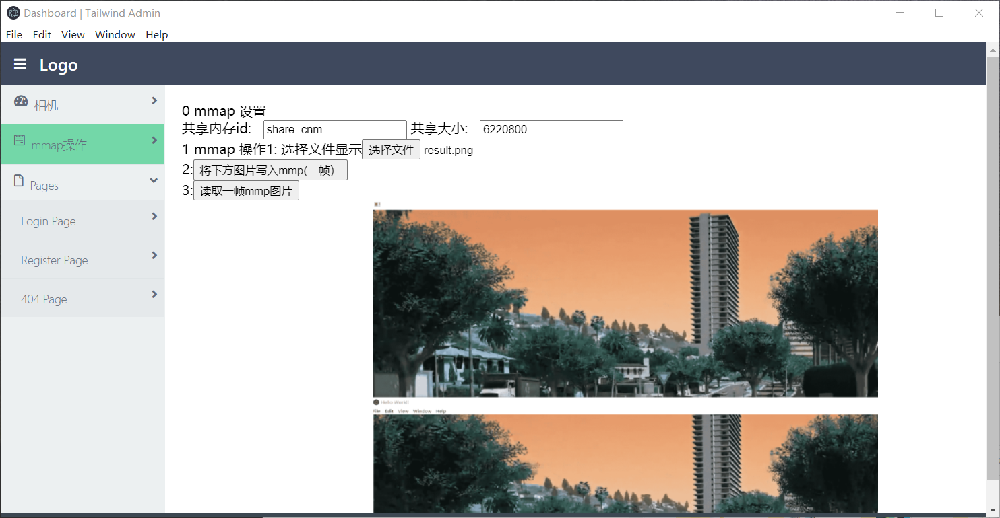

# 安装
## 1 安装大部分依赖
```
npm install
```

## 2 electon有bug  需要这样安装
```
cd .\node_modules\electron\
node install.js
```

## 3 启动应用
```
electron .
```
## 4 效果如图



#  思路讲解
① 总界面A
```

src/main_ui/qianmin.html 表示总界面A
A：抄的一个界面模板  纯html
架构如下：
div
    header
    div
        sidebar
        main
    div
    foot
div
模板架构不能变，因为css文件写死了
qianmin.js仅仅操作了界面，什么核心功能没干
```
② 某个功能界面B
```

src/fun_camera/mmap_img_v4.html 表示其中一个功能模块B
B使用了node模块，实现mmao功能

③A通过webview标签 嵌入B

```
③webview
单独进程运行某个html 且支持node
下面代码巧妙在于  
如何只显示一个webview呢？ 
div包裹webview div display=none即可隐藏 dispaly=""即可显示  webview进程不会刷新
```
<div id="id_div_fun2">
 <webview
        id="id_webview_fun1"
        src="../fun_camera/mmap_img_v4.html"
        nodeintegration
        webpreferences="contextIsolation=no"
        style="display:inline-flex; width:100%; height:800px">
    </webview>
</div>
```

# 总结
有了这个思路

开发者只需关注如何做出单个功能，做好了，嵌入到该框架中即可。

## 如何添加一个新的功能模块（html with node）？
1 qianmin.html 操作
```
在<div id="id_div_fun">中按照上面 div webview添加一个

复制一个li 改好 按钮名字
```
2 qianmin.js 操作
```
俩hide函数 添加新加的东西

vue里面写好函数  照抄即可
```
ok  无限制套娃吧！！！！！！


